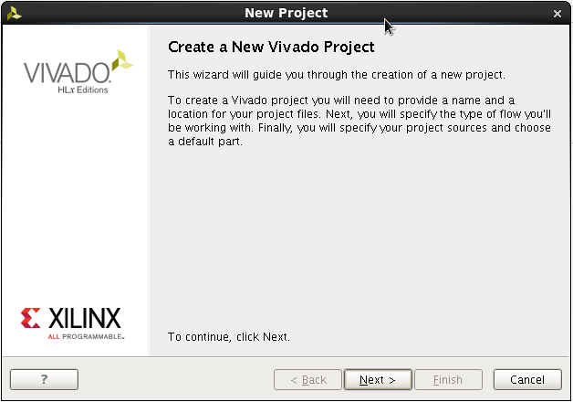

# Creating a Custom AXI4 Master in Vivado (Zedboard)

This tutorial shows how to generate a custom AXI4 Master with burst functionality in Vivado and how to connect it to the HP Port of the Zynq PS on the Zedboard. 

## Requirements

- Vivado 2016.2
- Zedboard

## Creating a New Vivado Project

1. Start Vivado.
2. Choose "Create New Project" in the Vivado welcome menu.

  

3. Click "Next >".

  

4. Choose a name for your project and a location. The project name in this tutorial is `axi4_master_burst_example`.

  
