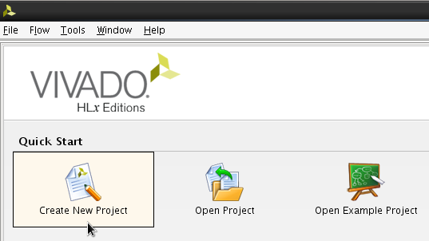

# Creating a Custom AXI4 Master in Vivado (Zedboard)

This tutorial shows how to generate a custom AXI4 Master with burst functionality in Vivado and how to connect it to the HP Port of the Zynq PS on the Zedboard. 

## Requirements

- Vivado 2016.2
- Zedboard

## Creating a New Vivado Project

Firstly, one has to start Vivado and create a new project.

