# Creating a Custom AXI4 Master in Vivado (Zedboard)

This tutorial shows how to generate a custom AXI4 Master with burst functionality in Vivado and how to connect it to the HP Port of the Zynq PS on the Zedboard. 

## Requirements

- Vivado 2016.2
- Zedboard

## Creating a New Vivado Project

1. Start Vivado.
2. Choose "Create New Project" in the Vivado welcome menu.

    

3. Click _Next >_.

    

4. Choose a name for your project and a location. The project name in this tutorial is `axi4_master_burst_example`.

    

5. Choose _RTL Project_.

    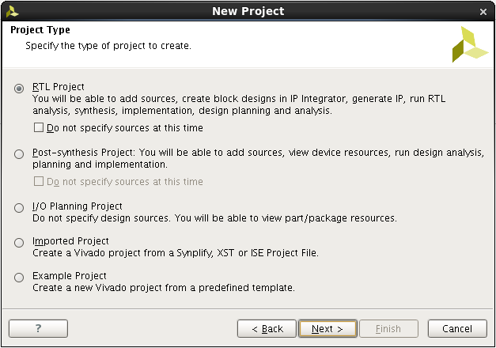

6. Don't add any HDL sources or netlists.

    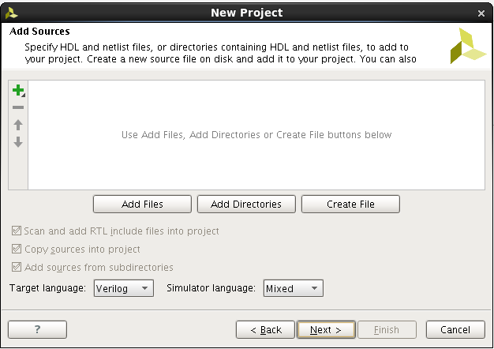

7. Don't add any existing IP components.

    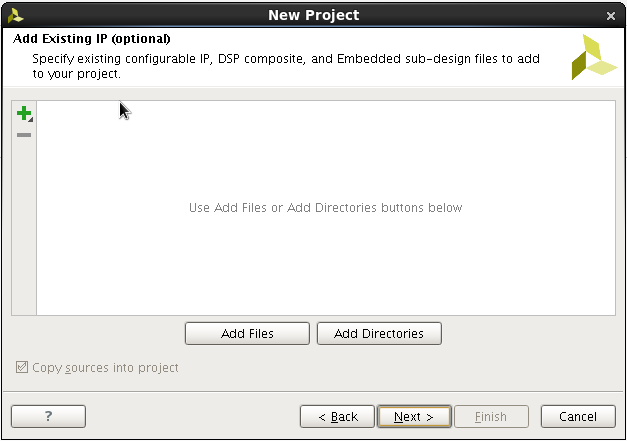

8. Don't add any constraints.

    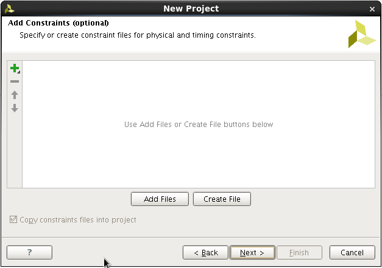

9. Choose _Boards_ and select _Zedboard Zynq Evaluation and Development Kit_.

    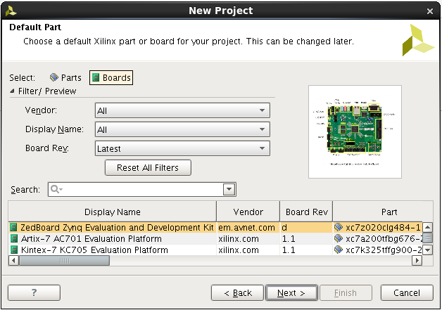

10. Click "Finish" to create the Vivado project.

    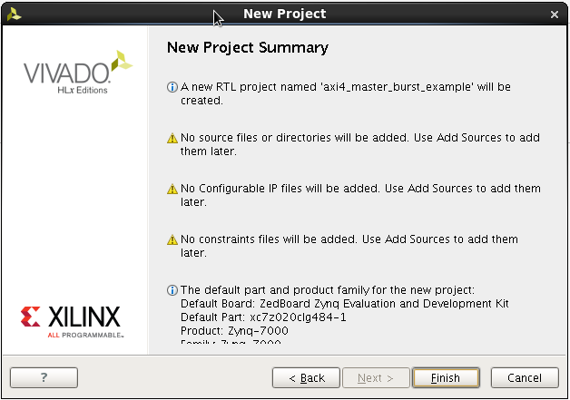

## Creating a Custom AXI IP

1. Open: _Menu -> Tools -> Create and Package IP_.

    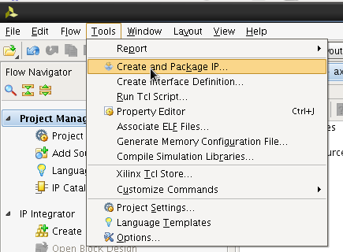

2. Click _Next >_.

    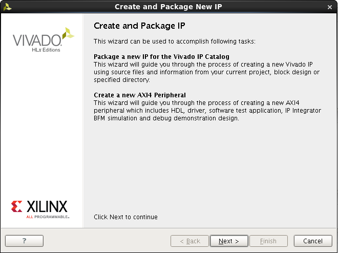

3. Choose _Create a new AXI4 peripheral_.

    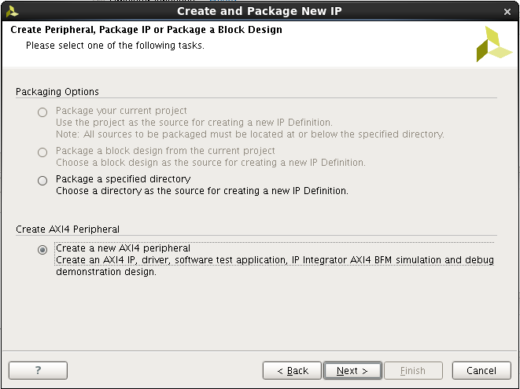

4. Choose a name, description and location for the new AXI4 peripheral. The name in this tutorial is `axi4_master_burst` and the location is [...]/ip_repo.

    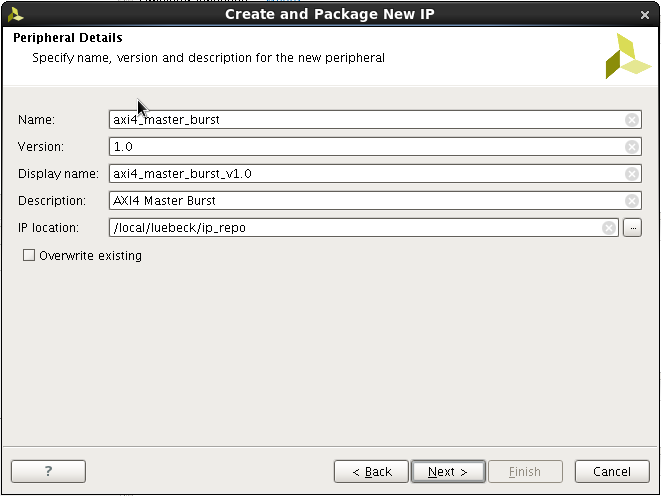

5. Keep the AXI4-Lite Slave interface.

    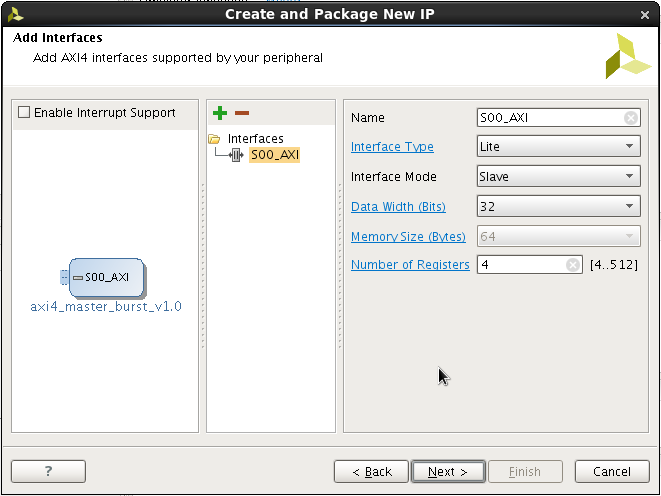

6. Click on the green plus sign to add another interface.

    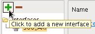

7. The added interface should be an AXI4-Full Master interface.

    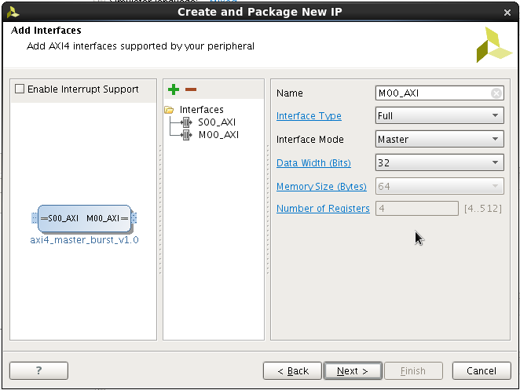

8. Choose _Edit IP_ and click on _Finish_

    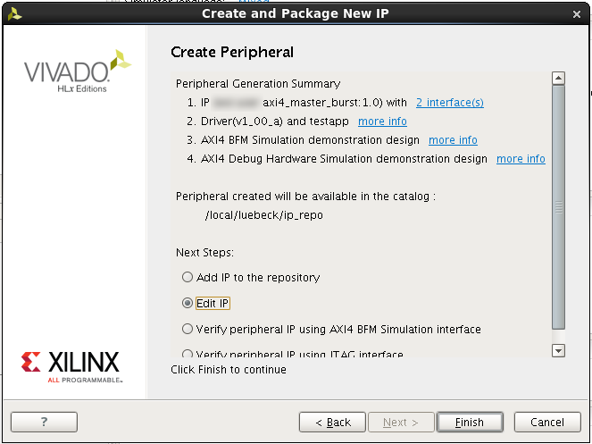
